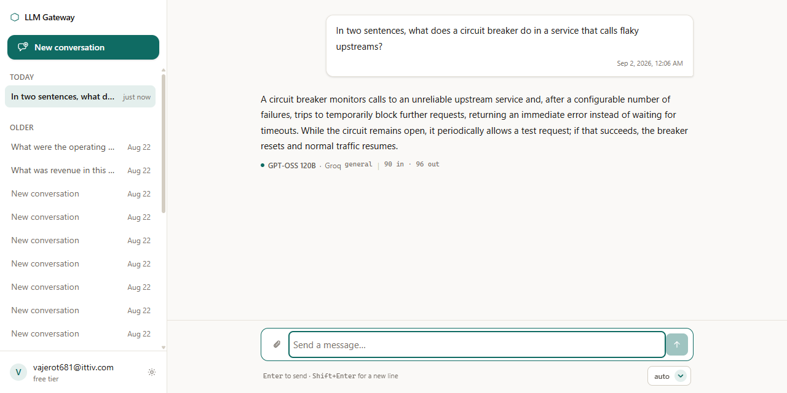
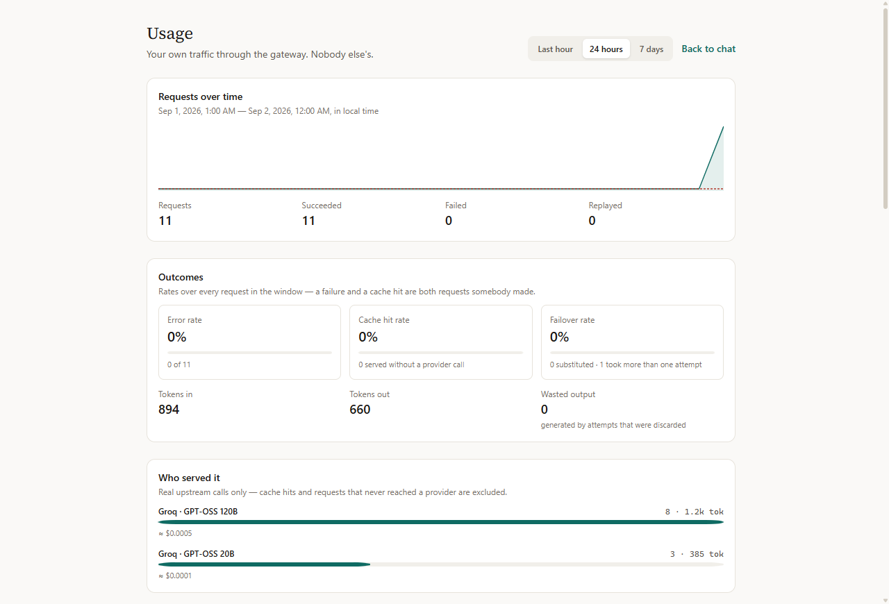
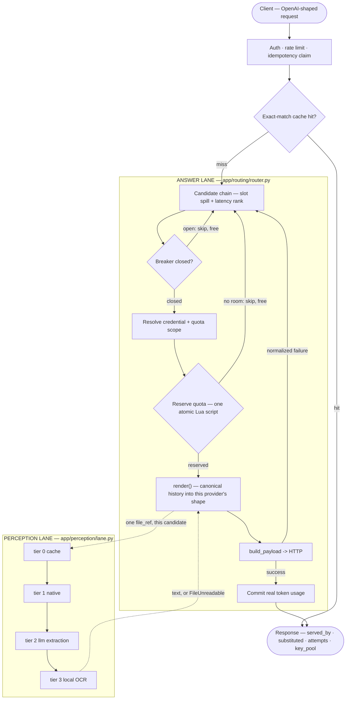

# LLM Gateway

One OpenAI-shaped API in front of three free-tier LLM providers — Groq, Gemini and OpenRouter — that
owns the conversation instead of proxying it.

## Overview

Free LLM tiers are generous but fragile: each has a different rate limit, a different daily quota, a
different idea of what a "model" is, and none of them tells you what to do when it runs out. This
gateway sits in front of all three and hides that. Clients ask for a **logical slot** (`fast`,
`general`, `auto`) rather than a model name; the router picks a candidate, reserves quota atomically
in Redis before the round trip, fails over when a provider dies — mid-stream included — and then
says on the wire exactly who actually answered. Conversation history lives in one canonical schema
and is re-rendered per provider, so switching models mid-thread is a non-event for the data. A
separate **perception lane** means a text-only model can still answer questions about your PDF.

It is a portfolio/learning project and runs entirely on free tiers — which is the constraint that
produced most of the interesting decisions.

## Demo

Every answer says which model actually produced it, and out of which slot — the disclosure is part of
the response, not a debug view:



The usage dashboard is self-scoped: your own traffic, provider mix, failover and cache rates, and a
simulated cost computed from a checked-in price table (nothing here is billed — these are free tiers):



And the chaos script drives the real app under load while providers die and recover on a schedule
(`make chaos-demo` — no live API is called; the upstream is the recorded fixtures the test suite
already commits):

```
$ python -m scripts.chaos_demo --seed 1

round   90/90   phase: recovery - breakers re-probe and close
requests   360   in flight  0   client-visible failures 0   substitutions 18   p50 130ms

  candidate                                         upstream  breaker    served
  groq/openai/gpt-oss-120b                          ok        closed     157
  groq/openai/gpt-oss-20b                           ok        closed     72
  gemini/gemini-3.6-flash                           ok        open       46
  gemini/gemini-3.5-flash-lite                      ok        closed     85

  requests sent ................. 360 (81 streamed)
  targets killed ................ 5
  CLIENT-VISIBLE FAILURES ...... 0
  substitutions disclosed ...... 18
  statuses ..................... {'200': 360}
```

Full transcript, the phase schedule, and an honest "what this does *not* prove" section:
[`docs/chaos-demo.md`](docs/chaos-demo.md).

## Features

- **Slot-based routing** — ask for `fast`/`general`/`auto`, not a model name. `auto` is ordered by
  measured p50 latency; a named slot spills into the rest of the fleet once its own candidates are spent.
- **Failover that stays honest** — a dead provider is skipped silently, then disclosed: every response
  carries `served_by`, `substituted` and the full `attempts` trail. A mid-stream failure discards the
  partial, emits a `restart` event, and resumes on a different model over the same open 200.
- **Atomic quota tracking** — RPM / RPD / TPM / TPD per provider, checked and spent inside a single
  Redis Lua script so the check cannot be raced. A candidate with no room is skipped *before* the round trip.
- **Perception lane** — upload a PDF or image and any model can answer about it: native passthrough for
  models that read files, a dedicated extraction call for those that cannot, and local
  PyMuPDF/Tesseract as a last resort. A degraded reading is labelled, never silent.
- **Memory across providers** — one canonical history, re-rendered into each provider's payload shape.
  Context overflow truncates the oldest turns and reports how many it dropped.
- **Bring your own key** — paste a provider key and the next message uses it. Resolved *per candidate*,
  so one failover chain can spend a private key and a shared one and bill each to the right budget.
- **Idempotency** — `Idempotency-Key` makes a retried request return the original answer instead of a
  second conversation and a second draw on a daily budget.
- **Self-scoped observability** — a usage dashboard (volume, provider mix, error and cache rates,
  simulated cost off a checked-in price table), `/metrics` in Prometheus format, per-request attempt trails.

## Tech stack

| | |
|---|---|
| **API** | Python 3.12, FastAPI, SQLAlchemy 2.0 (async), Alembic, pydantic v2, structlog |
| **Data** | Postgres (Supabase), Redis (Upstash) — quota, breaker state, cache, idempotency |
| **Providers** | Groq, Google Gemini, OpenRouter — one adapter each behind a frozen protocol |
| **Frontend** | Next.js 15 (App Router), React 19, Tailwind v4, SWR |
| **Auth** | Supabase Auth (JWT via JWKS) for humans, `gw_live_` API keys for programmatic use |
| **Files** | Supabase Storage, PyMuPDF + Tesseract for local extraction |
| **Tooling** | pytest + pytest-asyncio, ruff, mypy (strict), Vitest, Docker, GitHub Actions |
| **Deploy** | Render (API), Vercel (frontend), Supabase, Upstash |

## Architecture

Two lanes, one request. The answer lane picks a model and gets a response out of it; the perception
lane independently decides how an attached file reaches whichever model that turned out to be.



The failover loop's branching, the streaming restart state machine, the quota
reserve → commit/release lifecycle and the two-pool credential diagram are drawn in
[`docs/architecture.md`](docs/architecture.md).

## Setup

Needs Python 3.12, Docker (for Postgres and Redis), and Node 20+ for the frontend.

```bash
git clone <repo-url> llm-gateway
cd llm-gateway

# 1. Configuration
cp .env.example .env
python -c "from cryptography.fernet import Fernet; print(Fernet.generate_key().decode())"
#    paste that into ENCRYPTION_KEY, then fill in the Supabase URL and the three provider keys

# 2. Dependencies and services
make install                      # pip install -e ".[dev]"
docker compose up -d postgres redis
make migrate                      # alembic upgrade head

# 3. Run
make dev                          # http://localhost:8000 — interactive docs at /docs
```

Frontend, in a second shell:

```bash
cd frontend
cp .env.local.example .env.local  # Supabase project + gateway URL
npm install
npm run dev                       # http://localhost:3000
```

Checks:

```bash
make test           # pytest — never calls a live provider; everything is recorded fixtures
make lint           # ruff check + ruff format --check
make typecheck      # mypy, strict
make frontend-test  # vitest
make chaos-demo     # kill providers under load and watch nobody notice
```

## Usage

Authenticate with a Supabase JWT (`Authorization: Bearer <jwt>`) or a gateway API key
(`X-API-Key: gw_live_…`). The body is OpenAI-shaped, except `model` names a **slot**.

```bash
curl -X POST http://localhost:8000/v1/chat/completions \
  -H "X-API-Key: gw_live_..." \
  -H "Content-Type: application/json" \
  -d '{
        "model": "auto",
        "messages": [{"role": "user", "content": "Explain circuit breakers in one paragraph."}]
      }'
```

The response is OpenAI's shape plus everything the gateway knows about how it got there:

```jsonc
{
  "id": "req_...",                  // also X-Request-ID, and on every log line for this call
  "object": "chat.completion",
  "model": "openai/gpt-oss-120b",
  "choices": [{"index": 0, "message": {"role": "assistant", "content": "..."}, "finish_reason": "stop"}],
  "usage": {"prompt_tokens": 24, "completion_tokens": 180, "total_tokens": 204, "estimated": false},

  "served_by": {"slot": "fast", "provider": "groq", "model": "openai/gpt-oss-120b"},
  "requested_slot": "auto",
  "substituted": false,             // true when a named slot was overridden by failover
  "attempts": 2,                    // how many provider attempts this turn took
  "key_pool": "shared",             // "private" when the user's own key paid for it
  "extraction_tier": null,          // cache | native | llm | local, when the turn had an attachment
  "degraded": false,
  "messages_dropped": 0             // history truncated to fit the context window
}
```

Continue a thread by passing `conversation_id`. Stream with `"stream": true` — SSE frames are
`meta` → `delta`* → optional `restart` → `done`, and the `done` event carries the same provenance
fields. Retry safely with `Idempotency-Key: <uuid>`.

**Other endpoints**

| | |
|---|---|
| `GET /v1/models` | Slots and candidates with **live** quota and breaker status, no upstream calls |
| `POST /v1/files` | Upload a PDF/PNG/JPEG/WebP; reference it as `file_refs` on a message |
| `GET /v1/conversations` · `/{id}` · `/{id}/messages` | Threads, detail, keyset-paginated history |
| `POST /v1/keys` · `/v1/provider-keys` | Gateway API keys; BYOK provider keys |
| `GET /v1/admin/usage` · `/quota` · `/requests` | Your own usage aggregates and request trail |
| `GET /metrics` · `/healthz` · `/readyz` | Prometheus exposition, liveness, readiness |

## Configuration

Every variable is documented inline in [`.env.example`](.env.example), which mirrors
`app/config.py::Settings` exactly — a missing one kills the process at boot and names itself. The
ones you must set:

| Variable | |
|---|---|
| `DATABASE_URL` | Postgres, async driver (`postgresql+asyncpg://…`) |
| `REDIS_URL` | Quota, breaker state, cache, idempotency |
| `SUPABASE_URL` | JWKS is fetched from here; the project must use ES256/RS256, not the legacy shared secret |
| `GROQ_API_KEY` · `GEMINI_API_KEY` · `OPENROUTER_API_KEY` | The shared free-tier pool |
| `ENCRYPTION_KEY` | Fernet key encrypting BYOK keys at rest. **Losing or rotating it makes every stored user key unreadable** — nothing crashes, those users silently fall back to the shared pool |
| `SUPABASE_SERVICE_ROLE_KEY` | Only when `FILES_STORAGE_BACKEND=supabase` |

Notable switches, all defaulting on: `QUOTA_ENFORCEMENT`, `CACHE_EXACT_ENABLED`,
`RATE_LIMIT_ENABLED`, `PERCEPTION_ENABLED`, `ROUTING_LATENCY_RANKING`, `METRICS_ENABLED`. Each
exists so its feature can be switched off in one deploy when that feature is the thing under debug.

Frontend: `NEXT_PUBLIC_SUPABASE_URL`, `NEXT_PUBLIC_SUPABASE_ANON_KEY`, `GATEWAY_URL` — see
[`frontend/README.md`](frontend/README.md). The browser never calls the API host directly; Next
rewrites `/api/gw/*`, so there is no CORS to configure.

## Project structure

```
app/
  api/              FastAPI routes — v1/{chat,models,files,conversations}, auth, keys, admin
  providers/        One adapter per provider behind a frozen ProviderAdapter protocol
  routing/          Candidate selection, the failover loop, the circuit breaker
  quota/            The Redis quota tracker + its Lua reserve/commit/release scripts
  memory/           Canonical message schema and the six-step render pipeline
  perception/       The four-tier file-understanding lane
  streaming/        SSE framing, the stream orchestrator, the post-stream collector
  cache/            Redis key builders, exact-match cache, idempotency store
  keys_resolution/  BYOK: which key, and whose budget — resolved per candidate
  usage/            Structured request logging, /metrics, simulated pricing
  db/               SQLAlchemy models + one repo module per table
config/             providers.yaml (the slot table), limits.yaml, pricing.yaml
frontend/           Next.js App Router client
tests/              unit · contract (golden payloads) · integration
scripts/            record_fixtures.py, chaos_demo.py, seed_dev.py
docs/               architecture · limitations · deploy · chaos-demo · decisions/ (ADRs)
doc/reference/      The source specs and per-phase plans
```

## Design decisions

Thirty-eight architecture decision records live in [`docs/decisions/`](docs/decisions/), each stated
as the question it answers. Worth reading first:

- [ADR-012](docs/decisions/ADR-012-mid-stream-failover.md) — a stream dies at token 200: splice, resume, or start over?
- [ADR-018](docs/decisions/ADR-018-quota-fails-closed.md) — quota is the one thing that fails *closed*; what does that then mean for `/readyz`?
- [ADR-020](docs/decisions/ADR-020-quota-reservation-placement.md) — why a Lua script and not a Redis pipeline?
- [ADR-025](docs/decisions/ADR-025-extraction-at-render-not-upload.md) — when does a document get read: at upload, or the moment somebody asks about it?
- [ADR-031](docs/decisions/ADR-031-cross-provider-golden-matrix.md) — where do you assert "one history, three payload shapes"?
- [ADR-034](docs/decisions/ADR-034-per-candidate-credential-resolution.md) — "which key" and "whose budget": one question or two?
- [ADR-013](docs/decisions/ADR-013-hand-rolled-breaker-and-retries.md) — why is there no `pybreaker` and no `tenacity` in this repo?

What is deliberately *not* built, and why, is in [`docs/limitations.md`](docs/limitations.md). The
deployed-instance runbook is [`docs/deploy.md`](docs/deploy.md), and the full design specs are in
[`doc/reference/`](doc/reference/).

## Contributing

This is a personal learning project, so it is not looking for feature PRs — but issues pointing out
a bug or bad reasoning are welcome. If you do open a PR, `make lint typecheck test` and
`make frontend-lint frontend-test` must pass. Tests never call a live provider; record fixtures once
with `make record-fixtures`.

## License

MIT — see [LICENSE](LICENSE).
