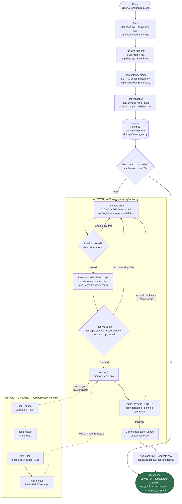

# LLM Gateway

One OpenAI-shaped API in front of three free-tier providers — Gemini, Groq and OpenRouter — that owns
the conversation instead of proxying it. It routes each turn across *logical model slots* rather than
model names, fails over when a free tier runs out and says so on the wire, tracks every provider's
heterogeneous quota (RPM/RPD/TPM/TPD) atomically in Redis, and runs a second, independent "perception
lane" so a text-only model can still answer questions about your PDF. Users can bring their own
provider key, resolved per candidate, so one failover chain can spend a private key and a shared one
and count each against the right budget. It is a portfolio/learning project and it runs entirely on
free tiers — which is the constraint that produced most of the interesting decisions below.

Full design docs live in [`doc/reference/`](doc/reference/) — start with
[`project-overview.md`](doc/reference/project-overview.md) for the pitch and
[`contracts-and-phase1.md`](doc/reference/contracts-and-phase1.md) for the frozen contracts
everything else is built against. Decision records are indexed under
[Design Decisions](#design-decisions); the honest-edges document is
[`docs/limitations.md`](docs/limitations.md).

---

## Architecture

Two lanes, one request. The answer lane picks a model and gets a response out of it; the perception
lane, entirely independent, decides how an attached file reaches whichever model that turned out to
be. The dotted edges are the only place they meet: render step 1, per attempt.



The failover loop's own branching, the streaming restart state machine, the quota
reserve → commit/release lifecycle, the four-tier perception chain and the two-pool credential diagram
are all drawn in [`docs/architecture.md`](docs/architecture.md).

---

## A request, end to end

One `POST /v1/chat/completions`, traced through the code. Every hop names the file and the function,
so this doubles as a tour of the repo.

| # | Hop | Where | What actually happens |
|---|---|---|---|
| 1 | **Authenticate** | `app/auth/dependency.py::get_principal` | A Supabase JWT (verified against cached JWKS) or a `gw_live_` gateway key collapses to one four-field `Principal`. Quota and rate limits key on `user_id`, never on the key that was presented — one user with three integrations is one budget (D7, ADR-007). |
| 2 | **Rate-limit** | `app/deps.py::RateLimiter.enforce` | Two sliding windows (`rpm`, `rpd`) over `rl:{user_id}:{window}:{window_start}`, ceilings from `config/limits.yaml`'s `gateway:` block by tier. Fails **open** — the opposite of quota's rule, and ADR-022 says why. |
| 3 | **Validate the slot** | `app/api/v1/chat.py::_validate_slot` | `fast`, `general`, `pro` or `auto`. A typo is a 400 here, before anything is written or spent — deliberately ahead of the claim below, so an unservable request burns no idempotency key. |
| 4 | **Claim the idempotency key** | `app/cache/idempotency.py::IdempotencyStore.claim` | Only when the caller sent `Idempotency-Key`. One `SET NX EX` on `idem:{user_id}:{key}` storing a fingerprint of the whole request, with four outcomes: claimed, replay, in-flight (409 + `Retry-After`), fingerprint mismatch (409). Before the conversation is touched, which is the entire point (D6/D47). |
| 5 | **Resolve the conversation** | `app/api/v1/chat.py::_resolve_conversation` | Ownership-scoped in the SQL itself (`WHERE id = :cid AND user_id = :uid`). A miss is a 404, never a 403 — there is no fetch-then-check anywhere in this codebase. |
| 6 | **Persist the inbound turn** | `app/db/repo/messages.py::append` | The user message is written as canonical blocks (Contract B), `seq` gap-free, and the transaction is then released. No provider's own request body is ever stored. |
| 7 | **Try the exact cache** | `app/cache/exact.py::request_hash` → `ExactCache.get` | Deterministic requests only (`temperature == 0`). A hit returns from here having touched no provider, no breaker and no quota, with `X-Cache: HIT` (D5/D19, ADR-023). |
| 8 | **Build the candidate chain** | `app/routing/selection.py::candidates` | The named slot's own candidates first, then a spill into the rest of the fleet (D10, ADR-011), ranked by measured latency for `auto` (D11, ADR-014). A pure function — no I/O, which is what lets `GET /v1/models` reuse it to report status. |
| 9 | **Skip what cannot work** | `app/routing/circuit_breaker.py::CircuitBreaker.allows` | An open breaker is skipped for free: it costs no attempt against D1's budget of three (ADR-015). |
| 10 | **Resolve credential and scope** | `app/keys_resolution/resolver.py::UserCredentials.for_provider` | One object answers both questions at once — *which key* and *whose budget* — per candidate, memoized per request behind a single query (D36/D38, ADR-034). |
| 11 | **Reserve quota** | `app/quota/tracker.py::QuotaTracker.reserve` | Every declared window checked and then incremented inside one Lua script, so the check cannot be raced. No room means skipping this candidate *before* the round trip; Redis unreachable means failing **closed** (D15, ADR-018). |
| 12 | **Render** | `app/memory/render.py::render` | Resolve attachments (this is where the perception lane runs, once per candidate) → materialize → budget → fit (D4's truncation, leaving an omission marker) → `build_payload` → a `RenderReport`. The only path to a provider payload in the system. |
| 13 | **Attempt** | `app/providers/{groq,gemini,openrouter}.py::complete` / `stream` | The one thing that leaves the process. Every provider quirk dies inside `parse_error`, which normalizes it to one of seven error classes carrying `retryable_same_provider` / `failover_eligible` / `breaker_eligible` (Contract A). |
| 14 | **Fail over** | `app/routing/router.py::route` / `route_stream` | The loop branches on those flags and never on `isinstance` or `adapter.name`: retry once here, advance to the next candidate, or abort the whole request. Mid-stream it is `app/streaming/orchestrator.py` that decides instead — discard the partial, emit `restart`, start again on a different candidate (D1, ADR-012). |
| 15 | **Commit the real usage** | `app/quota/tracker.py::QuotaTracker.commit` | The reservation estimated; the response reports. The difference is reconciled, and any `QuotaHint` the provider's own rate-limit headers carried is applied on top of the counter (D18, ADR-021). |
| 16 | **Persist and log** | `app/usage/logger.py::record_success` | The assistant message with its full `meta`, plus one `requests` row carrying the attempt trail, `quota_scope` and `cache_hit` — and the `/metrics` counters, incremented here and nowhere else. A streamed turn does all of this from `app/streaming/collector.py`, after `done`, on its own short-lived session (D14, ADR-016). |
| 17 | **Disclose** | `app/api/v1/chat.py::_to_response` | `served_by`, `substituted`, `attempts`, `key_pool`, `extraction_tier`, `degraded`, `messages_dropped`, `warning` — and the same facts on the SSE `done` event, asserted equal by a test. This is not UI polish; it is what makes silent failover honest (D1/D2). |

---

## What happens when things break

Every answer below already exists in the code and in an ADR. This table is where they stop being
scattered.

| What dies | What the client sees | Why, and where |
|---|---|---|
| **Postgres** | `/readyz` → 503, so the platform stops routing to the instance. An in-flight chat turn 500s with a `request_id`; a stream already committed to 200 finishes streaming and loses only its persistence — logged and swallowed, because there is no response left to turn it into. | `app/main.py::readyz`, ADR-009/ADR-010; the swallow rule is ADR-016. |
| **Redis, with `QUOTA_ENFORCEMENT=true`** | `/readyz` → 503 `redis_unavailable`. Quota fails **closed**: every candidate is refused before its round trip, so the turn 502s rather than quietly overspending a free-tier key nobody can see the counter for. | D15, [ADR-018](docs/decisions/ADR-018-quota-fails-closed.md) — "closed at the candidate is closed at the request". |
| **Redis, with enforcement off** | Nothing. The exact cache reports `X-Cache: BYPASS`, the rate limiter admits everyone, idempotency silently disables itself and serves the request, the breaker allows, and `/metrics` still returns its counters with the live gauges omitted rather than 500ing. | Everything Redis-backed *except* quota fails **open**: ADR-010, ADR-022, ADR-023, and D47 for idempotency. |
| **One provider, before the first byte** | An answer, from a different model. The failure is normalized by `parse_error`, the breaker records it, and the router advances down the chain. The response names who actually served it — `served_by`, `substituted: true`, and the full `attempts` trail. | D1/D2: silent failover, then disclosure. `app/routing/router.py`. |
| **One provider, mid-stream** — say Groq falls over at token 200 | The partial answer is **discarded**, a `restart` event is emitted naming how many characters were thrown away, and a *different* candidate starts the answer over on the same, still-open 200. Never the same candidate: one that accepted a connection and then died has told you something. Up to three attempts, then a terminal `done{status: "failed"}` carrying `partial_content` if at least 40 characters had been produced. | D1, [ADR-012](docs/decisions/ADR-012-mid-stream-failover.md); the state machine is drawn in [`docs/architecture.md`](docs/architecture.md). |
| **Every provider** | Before the first byte: a 502 JSON envelope with a `request_id`, and the whole attempt trail written to the `requests` row for the dashboard to show. After the first byte: the `done{status: "failed"}` above — the response was already committed to a 200, and pretending otherwise would be worse than saying so. | D13 (`app/streaming/orchestrator.py`); ADR-015 for why the budget is three attempts and what spends one. |
| **The object store** | Uploads 503 with `storage_unavailable`, normalized so no `httpx` error, URL or service-role key ever reaches the client. Turns about a document that has already been read are unaffected: perception tier 0 needs no bytes at all. | `app/api/v1/files.py`, ADR-026. |
| **The extraction lane** — Gemini down, or its fenced daily budget spent | The answer still arrives, worse and labelled: tier 2 logs and falls through to local PyMuPDF/Tesseract, and the response carries `extraction_tier: "local"` with `degraded: true`. Only if tier 3 also cannot read the file does the turn stop, with a 422 naming that file — answering a question about a document nobody read is the worst option on the table. | D25, [ADR-028](docs/decisions/ADR-028-tier-chain-and-failure-rule.md). |
| **A user's own provider key** (revoked, expired, rotated at the provider) | An `AuthFailed` on a private key is never retried on the shared key for the same provider. The chain moves to the next *provider*, the answer still arrives, and the stored row is flagged `invalid` so Settings can say so out loud instead of hiding a dead key forever. | D40, [ADR-037](docs/decisions/ADR-037-private-key-failure-is-not-laundered.md). |
| **`ENCRYPTION_KEY` lost or rotated** | Every stored provider key becomes unreadable, one log line each, and every affected user silently falls back to the shared pool. Nothing 500s and nothing is deleted. | `app/core/crypto.py`'s `CredentialUnreadable`, ADR-035; the operational consequence is in [`docs/deploy.md`](docs/deploy.md). |
| **Supabase Auth (JWKS)** | Stale cached keys keep serving — logging everyone out because Supabase had a bad minute is the wrong trade. Only a cold cache with no keys at all returns 503 `jwks_unavailable`, and it is a 503 rather than a 401 because it is our outage and not a bad token. `gw_live_` API keys verify against Postgres and are unaffected. | `app/auth/jwt.py::JwksCache._refresh`. |

Most of this table is driven on purpose by the chaos script:
[`docs/chaos-demo.md`](docs/chaos-demo.md) — 360 requests, five candidates killed and revived on a
schedule, zero client-visible failures, and a section on what an in-process mock does *not* prove.

---

## Design Decisions

All thirty-eight records, grouped by area and stated as the question each one answers rather than by
number — nobody reads an index by number. The numbering runs 007…045 with gaps: Phase 1 planned
ADR-001…008 and ended up writing only two records at all (007 and 009), and the holes were left open
rather than renumbered afterwards.

**Identity and limits**

- [ADR-007](docs/decisions/ADR-007-auth-model.md) — Two authentication surfaces, a browser JWT and a programmatic key: are they two identities? *(No, and quota keys on `user_id`.)*
- [ADR-022](docs/decisions/ADR-022-our-own-rate-limiting.md) — The providers already rate-limit us; why limit our own users too, and what did doing it cost a frozen key schema?
- [ADR-039](docs/decisions/ADR-039-validation-endpoint-rate-limiting.md) — One endpoint makes an outbound call on the user's behalf; how is an anti-abuse floor different from a throughput limit?

**Degradation and health**

- [ADR-009](docs/decisions/ADR-009-readiness-probe-scope.md) — What belongs in a readiness probe? *(Superseded in part by ADR-010.)*
- [ADR-010](docs/decisions/ADR-010-redis-fail-open-and-readiness.md) — Redis is down: refuse traffic, or serve it degraded?
- [ADR-018](docs/decisions/ADR-018-quota-fails-closed.md) — Quota is the one thing that fails *closed*; what does that then mean for `/readyz`?

**Routing and failover**

- [ADR-011](docs/decisions/ADR-011-named-slot-spill.md) — You asked for `fast` and `fast` is spent: refuse, or answer from something else?
- [ADR-012](docs/decisions/ADR-012-mid-stream-failover.md) — A stream dies at token 200: splice, resume, or start over?
- [ADR-013](docs/decisions/ADR-013-hand-rolled-breaker-and-retries.md) — Why is there no `pybreaker` and no `tenacity` in this repo?
- [ADR-014](docs/decisions/ADR-014-latency-ranked-auto.md) — What does `auto` actually mean, and what data is allowed to rank it?
- [ADR-015](docs/decisions/ADR-015-attempt-cap.md) — Three attempts per message: what counts as one?
- [ADR-016](docs/decisions/ADR-016-streaming-session-lifetime.md) — Who holds the database session while a model streams for thirty seconds? *(Nobody.)*

**Quota, caching and the wire**

- [ADR-019](docs/decisions/ADR-019-quota-window-model.md) — Four kinds of window under one frozen key format; how do they coexist?
- [ADR-020](docs/decisions/ADR-020-quota-reservation-placement.md) — Where in the failover loop does a reservation belong, and why is the reservation itself the filter?
- [ADR-021](docs/decisions/ADR-021-quotahint-transport.md) — A provider's own rate-limit headers are better data than our counter; how do they reach the tracker without widening a frozen contract?
- [ADR-023](docs/decisions/ADR-023-exact-cache-identity-and-scope.md) — What makes two requests "the same", and may one user's answer be replayed to another?
- [ADR-024](docs/decisions/ADR-024-models-endpoint-shape.md) — `GET /v1/models` has to be OpenAI-compatible *and* report live quota; which shape wins?
- [ADR-042](docs/decisions/ADR-042-idempotency-claim-before-routing.md) — A client retries after a timeout: how do you charge them once, and where in the request must you decide that?

**The perception lane**

- [ADR-025](docs/decisions/ADR-025-extraction-at-render-not-upload.md) — When does a document get read: at upload, or the moment somebody asks about it?
- [ADR-026](docs/decisions/ADR-026-file-storage-and-ownership.md) — Content-addressed bytes are shared by definition; so who owns a file?
- [ADR-027](docs/decisions/ADR-027-perception-quota-under-frozen-contract-c.md) — Two lanes spend one Gemini free tier; how do you fence half of it off without a new key format?
- [ADR-028](docs/decisions/ADR-028-tier-chain-and-failure-rule.md) — Four ways to read a file: which order, and whose failure is allowed to reach the user?
- [ADR-029](docs/decisions/ADR-029-attachment-token-cost.md) — What does a natively attached image cost, in tokens you must reserve *before* you send it?
- [ADR-030](docs/decisions/ADR-030-local-tier-dependencies.md) — The last-resort tier needs OCR: what if the host has none, and what licence did PyMuPDF bring with it?

**Memory and cross-provider translation**

- [ADR-031](docs/decisions/ADR-031-cross-provider-golden-matrix.md) — Where do you assert "one history, three payload shapes" — at each adapter, or at the render boundary?
- [ADR-032](docs/decisions/ADR-032-pinning-without-tool-calls.md) — D3 pins a conversation on its first tool call, but v1 cannot store one; build the mechanism, or leave a seam?
- [ADR-033](docs/decisions/ADR-033-truncation-disclosed-and-uncached.md) — Two thirds of a thread got dropped to fit the window; who is told, and may that answer be cached?
- [ADR-043](docs/decisions/ADR-043-keyset-pagination-beside-the-full-read.md) — The UI wants a page of a long thread and the renderer wants all of it; one function or two?

**Bring your own key**

- [ADR-034](docs/decisions/ADR-034-per-candidate-credential-resolution.md) — "Which key" and "whose budget": one question or two, and answered how often?
- [ADR-035](docs/decisions/ADR-035-shared-pool-stays-in-the-environment.md) — There is a table for provider keys now; should the gateway's own keys move into it?
- [ADR-036](docs/decisions/ADR-036-personal-caps-under-frozen-contract-c.md) — How do you cap one user's share of the shared pool when the key schema is frozen?
- [ADR-037](docs/decisions/ADR-037-private-key-failure-is-not-laundered.md) — A user's key is rejected: retry it on the shared pool, or tell them?
- [ADR-038](docs/decisions/ADR-038-private-key-only-slots.md) — Your key unlocks a model nobody else can reach; should `auto` be allowed to pick it?

**Reading the system back**

- [ADR-040](docs/decisions/ADR-040-self-scoped-usage-dashboard.md) — There is no admin role in this system; what is an "admin dashboard" then?
- [ADR-041](docs/decisions/ADR-041-simulated-cost-at-read-time.md) — Nothing here is billed: where does a cost number come from, and what does an unpriced model cost?
- [ADR-044](docs/decisions/ADR-044-hand-rolled-metrics-endpoint.md) — Why is there no `prometheus_client`, and which of these numbers is a total and which is a sample?
- [ADR-045](docs/decisions/ADR-045-chaos-demo-drives-the-real-app.md) — How do you kill a provider on purpose without shipping a way to kill a provider on purpose?

**Deployment**

- [ADR-017](docs/decisions/ADR-017-render-as-deploy-target.md) — Fly.io's free allowance ran out mid-project; what does moving hosts actually change?

---

## In depth

Five questions, answered at length. They are the ones this project exists to be able to answer.

### Why is "which model answers" a different decision from "which model can see the file"?

Not every free-tier model reads a PDF or an image, and the ones that do meter it separately from
plain chat — so a gateway that only ever attaches a file to whichever model happens to be answering
loses file understanding the moment that model is a text-only one, or the moment its multimodal quota
runs dry. The perception lane exists to decouple the two questions entirely: *which model generates
this response* and *which model, if any, is used to understand an attached file* are handled by two
independent fallback chains, and a text-only model answering a question about a PDF is a normal case,
not a degraded one.

The chain (`app/perception/lane.py`) walks four tiers in order, and the same "always degrade, never
just fail" rule the rest of the gateway follows governs it: a cached reading beats a fresh one for
free; a native passthrough hands the bytes straight to a model that can read them; a dedicated
extraction call (Gemini, paid for out of a daily budget fenced off from plain chat, D8) reads the
document and writes a structured summary for a model that cannot; and if every provider option is
spent, local PyMuPDF/Tesseract still produces a worse-but-real answer rather than an error. Only the
last tier's failure is ever allowed to reach the user — every tier above it logs and falls through,
because a bug in one fallback should cost quality, not the whole request.

The interesting design decision was not "add file upload" — it was working out *when* the reading
happens. Extracting at upload time is the intuitive answer and the wrong one: the gateway does not
know which model will eventually answer, and a document extracted at upload has its extraction
frozen into that moment forever. Extraction instead resolves at render time, from a cache keyed on
the file's content hash — so a better prompt or a bigger extraction model retroactively improves
every stored conversation that ever referenced those bytes, the next time any of them is read. The
reasoning, and what it costs (the first turn about a document pays for its own extraction, in front
of the answer), is in
[ADR-025](docs/decisions/ADR-025-extraction-at-render-not-upload.md) and the rest of the
perception-lane ADRs (026–030) it sits alongside.

### Why a Lua script, and not a pipeline?

Every provider quota the gateway tracks — RPM, RPD, TPM, sometimes TPD — has to be checked and
spent atomically, or the check is worthless. The naive version reads a counter, sees room, and
increments it as two separate Redis round trips. Under any real concurrency that is a race: fifty
simultaneous requests can all `GET` a counter sitting at 9 against a limit of 10, all see room,
and all `INCRBY` — and the overshoot is invisible until the provider free-tier key gets
rate-limited earlier than predicted, or worse, banned for sustained over-limit traffic.

A Redis pipeline does not fix this. A pipeline batches commands into one round trip, but Redis
still executes each command in the batch as its own atomic step — nothing stops another client's
`GET` from landing between this pipeline's own `GET` and `INCRBY`. What actually closes the race is
a Lua script: Redis runs a script to completion, atomically, before serving another client's
command, so "check every window, then spend every window" becomes one indivisible operation no
concurrent caller can interleave with.

That is the whole reason `app/quota/scripts/reserve.lua` exists, and why it does the check in one
pass over every declared window before incrementing any of them in a second pass — a script that
incremented as it went and then bailed partway through would leave the earlier windows permanently
overstated, with no record of what to give back. The reserve → commit/release lifecycle built on
top of it (`app/quota/tracker.py`) is diagrammed in [`docs/architecture.md`](docs/architecture.md),
and the design reasoning is in
[ADR-020](docs/decisions/ADR-020-quota-reservation-placement.md).

A unit test exercises the claim directly rather than taking it on faith: fifty concurrent
`reserve()` calls against a limit of ten grant exactly ten (`tests/unit/test_quota_tracker.py`).
That test is the actual point of the Lua script, and it is the test that would fail first if the
atomicity were ever accidentally lost to a refactor.

### Why does the same history come out looking different for every provider?

The gateway stores one shape of conversation — a canonical schema (Contract B) that is deliberately
provider-agnostic — and never a provider's own request body. Every payload any provider ever receives is
built fresh, per attempt, from that one stored history, through a single six-step pipeline
(`app/memory/render.py`). That is what makes switching providers mid-conversation, whether by a user
picking a different slot or by D1/D2's own failover firing mid-request, a non-event for the data: the
history a Gemini attempt sees and the history a Groq attempt sees three messages later are the same rows,
rendered twice.

The interesting part is what "rendered" has to mean once the shapes genuinely disagree. Gemini lifts the
system message out of the message list into a top-level `system_instruction` field; Groq and OpenRouter,
both OpenAI-shaped, leave it as `messages[0]`. A `file_ref` has no shape at all until render decides
whether the candidate about to be tried can read the bytes natively or needs them injected as text — the
same stored block becomes Gemini's `inline_data` for one attempt and a `<document>`-wrapped extraction in
the next provider's prompt text a moment later, with no second upload and no second extraction call.
Context-window overflow gets the same treatment: the oldest messages are dropped and a plain-text
omission marker takes their place, because none of the three wire formats has a field for "some of this
was cut" — the marker is prose because prose is the one representation every provider actually reads.

A single test asserts the claim directly rather than trusting each adapter's own unit tests to add up to
it: `tests/contract/test_cross_provider_matrix.py` renders one fixed history through `render()` against
all three adapters, with and without an attachment, and pins six golden payloads plus three structural
properties — where the system message lands, that the omission marker survives into all three payload
texts identically, and that the extracted-document envelope is byte-for-byte identical between the two
providers it gets injected for. The reasoning for testing at the render boundary rather than at each
adapter's `build_payload` is in
[ADR-031](docs/decisions/ADR-031-cross-provider-golden-matrix.md); the "one history, three shapes"
diagram is in [`docs/architecture.md`](docs/architecture.md).

The demo this proves: start a conversation on `fast` (Groq), ask something, get an answer. Switch to
`general` and ask what you said first — the answer quotes it, and `served_by` names a different provider
than the one that answered turn one. Attach a PDF on the first turn and ask about it on the second — the
same uploaded bytes render natively for one model and as extracted text for the other, with one upload
and one extraction between them.

### What changes when you paste in your own API key?

The next message. Not the next session, not the next login — the next message, in the same
conversation, with no reload.

Open Settings → API Keys and every provider reads *Using shared pool*. Paste a Gemini key and the
gateway validates it against Gemini **before** storing anything: a bad key comes back with Google's
own wording and nothing is written, and a Gemini that happens to be *down* comes back as a distinct
"we couldn't check this" rather than as "your key is bad" — two sentences that lead to opposite next
actions, which is the entire reason there are two error codes. A good key is encrypted with Fernet,
stored, and the row flips to *Using your key · ••••a91c*. Send the next message and its provenance
says `key_pool: private`, the `requests` row carries `quota_scope = <your user id>`, and in Redis
`q:{you}:gemini:gemini-3.6-flash:rpd` has moved while `q:system:…` has not. Remove the key and the
message after that is back on the shared pool.

The part that is actually hard is that **BYOK is per provider, not per user**. One failover chain
crosses both pools: your Gemini key pays for candidate 1, and when it is spent, the gateway's shared
Groq key pays for candidate 2 — one request, two credentials, two sets of counters, neither leaking
into the other. So "which key" and "which budget" are one question answered *per candidate*, by one
injected object, and the old per-request `scope` parameter was deleted rather than kept alongside it
([ADR-034](docs/decisions/ADR-034-per-candidate-credential-resolution.md)). A private key that gets
rejected is never quietly retried on the shared key for the same provider: the chain moves to the
next *provider*, and the broken key's row is flagged so Settings can say so, because silently
laundering a dead key through the shared pool means the user is told everything is fine forever
([ADR-037](docs/decisions/ADR-037-private-key-failure-is-not-laundered.md)).

Two consequences worth naming rather than hiding. Your own key can unlock a slot nobody else sees —
`pro`, on a Gemini Pro model the shared free-tier key genuinely cannot reach — and `auto` still never
routes to it, because an `auto` that resolves differently per account is unreproducible and its cache
entries unshareable ([ADR-038](docs/decisions/ADR-038-private-key-only-slots.md)). And the exact
cache is keyed on the request, not on the user, so an answer your key paid for can be replayed to
someone else asking the identical question; that trade is written down in
[`docs/limitations.md`](docs/limitations.md) rather than discovered.

### What does `Idempotency-Key` actually protect you from?

A retry you did not make. A phone that changes network mid-request, a proxy that times out at thirty
seconds while the model is still generating, a client library that retries a 502 automatically — in
every one of those cases the original request may well have *succeeded*, and the retry is about to
create a second conversation, a second draw on a free tier's daily budget, and a thread with the same question
in it twice. Send the same `Idempotency-Key` with both and the second one gets the first one's answer
back, byte for byte, with `X-Idempotent-Replay: true`.

The whole design is in *where* the claim happens, and it is one line of the handler: after slot
validation, before the conversation is resolved (`app/api/v1/chat.py::create_chat_completion`). Claim
any later and a replay has already appended a duplicate user message and moved the thread's remembered
slot before discovering it had nothing to do. The claim itself is a single `SET NX EX` on
`idem:{user_id}:{key}` and never a `GET` followed by a `SET`, because the case worth protecting is two
*simultaneous* retries and only atomicity decides that one; the test that matters fires eight
concurrent claims and asserts exactly one winner. What gets stored is not a bare request id but an
envelope — state, a fingerprint of the request, the response body, whether it was streamed, and what
the original said about its own cache status — because a replay has to be able to repeat provenance it
did not recompute. Same key with a *different* body is a 409 rather than the wrong answer; a key still
in flight is a 409 with `Retry-After: 1`.

Two rules keep it from becoming a liability of its own. A claim creates a duty to call exactly one of
complete-or-release, on **every** path — which is why the endpoint is a thin wrapper with a single
`except BaseException` around the whole turn, and why a streamed turn is completed by the collector
after `done` rather than by a handler that returned long before the answer existed. A 502 that leaves
an `in_flight` envelope behind locks that key for a day and turns the client's next retry — the exact
thing this feature exists to serve — into a 409. And Redis being unreachable makes idempotency fail
**open**, not closed: the request is served exactly as it would have been if the feature did not
exist, because the alternative is a Redis blip becoming a total outage. That is caching's rule, not
quota's, and the difference between the two is [ADR-018](docs/decisions/ADR-018-quota-fails-closed.md)
versus [ADR-023](docs/decisions/ADR-023-exact-cache-identity-and-scope.md).

`X-Cache` and `X-Idempotent-Replay` are deliberately not the same header. A replay of a request that
was originally a cache hit sets both, because they answer two different questions: *did this call
compute anything* and *where did the answer being repeated originally come from*.

---

## Running it

```
make dev         # docker-compose: app + Postgres + Redis
make test        # pytest, no live provider calls — everything is recorded fixtures
make migrate     # alembic upgrade head
make chaos-demo  # kill providers under load and watch nobody notice
```

See [`.env.example`](.env.example) for required configuration and
[`docs/deploy.md`](docs/deploy.md) for the deployed-instance runbook.
</content>
