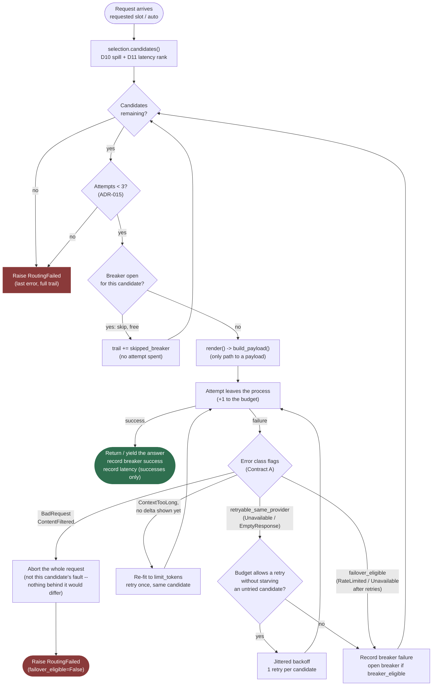
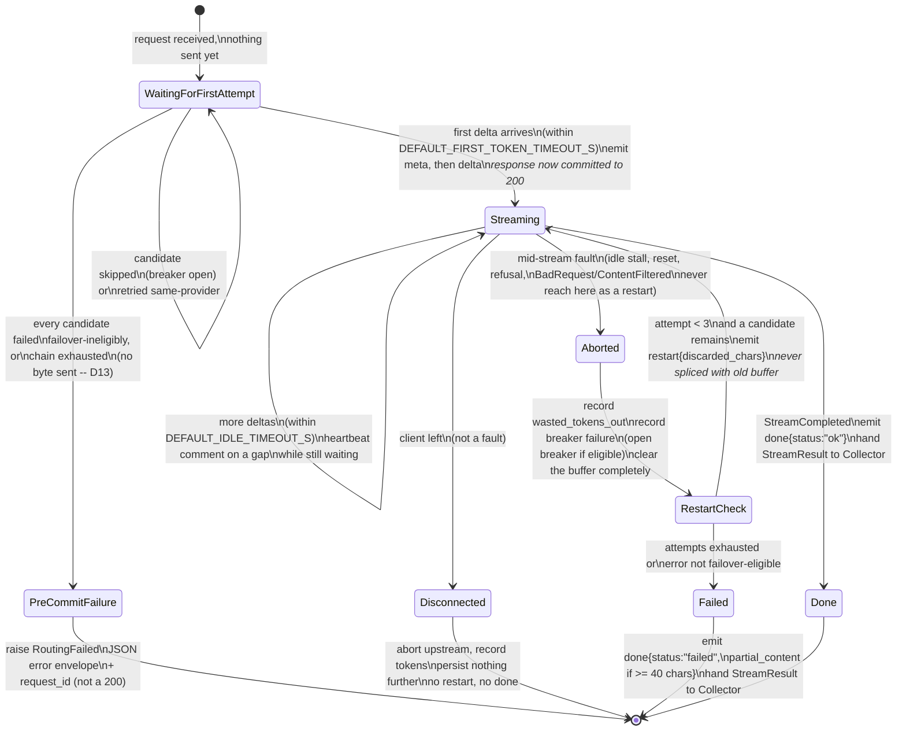

# Architecture

Two diagrams, both added at the close of Phase 2 because both only became true once Milestone B
landed: the failover loop that serves both the non-streaming and the streaming path
(`app/routing/router.py`), and the restart state machine layered on top of it for streaming turns
(`app/streaming/orchestrator.py`). Read alongside `doc/reference/contracts-and-phase1.md` §1 (D1/D2)
and `doc/reference/phase2.md` §3, which this page draws diagrams for rather than repeats.

---

## The failover loop

One entry point serves both `route` (non-streaming) and `route_stream` (streaming) — the alternative is
two copies of the attempt bookkeeping that drift, which `phase2.md` §4 Step 4 calls out explicitly. The
loop walks a candidate chain built by `selection.candidates()` (D10's named-slot spill, D11's
latency-ranked `auto` expansion) and makes exactly one branching decision per failure: *what kind* of
error was this, read off Contract A's class flags — never `isinstance`, never `adapter.name`.

**What is not on this diagram, deliberately:** the streaming path's first-token budget and mid-stream
restart. Those live one layer up — this loop only knows "the candidate I just tried failed before or
after producing a delta," and the *streaming-specific* consequence of a post-delta failure (never
retry, always restart) is the orchestrator's business, described next. `route_stream` reuses every box
above unchanged; it adds one extra rule not shown here — once a delta has been delivered, the same
candidate is never retried, because a restart onto a *different* provider is D1's mechanism for that
case, not this loop's own retry.

---

## The restart state machine (D1, streaming only)

`app/streaming/orchestrator.py::stream_completion` drives this on top of `route_stream`'s events
(`AttemptStarted`, `AttemptDelta`, `AttemptAborted`, `StreamCompleted`). The loop above decides *whether*
to try the next candidate; this state machine decides what the *client* is told and when the response
is allowed to start at all (D13).

**The rule the diagram cannot make self-evident, so it is stated here too:** `RestartCheck` never
re-enters `Streaming` on the *same* candidate. A candidate that delivered at least one delta and then
died has demonstrated it accepts a connection and then fails — a second attempt against it would spend
a budget slot exactly like an untried candidate, for worse odds. A restart always advances to a new
candidate; the same-provider retry in the failover loop above is reserved for failures that happened
*before* any content was shown.

---

## After `done` (D14)

Neither diagram shows persistence, on purpose — by the time either reaches a terminal state, the
response body is finished, and what happens next is a separate concern with its own lifetime rule
(ADR-016): the orchestrator holds no database session at any point above, and
`app/streaming/collector.py::Collector` opens one short-lived session *after* `Done` or `Failed`, writes
one row (or none, for a pre-commit failure — that one is the request-scoped session's job, one layer up
in `api/v1/chat.py`), commits, and closes. A persistence failure here is logged and swallowed, never
raised — there is no response left to turn it into.

---

## Where this leaves Phase 3

The failover loop's candidate chain is exactly where a quota filter attaches next: `selection.py`
documents a single insertion point, run *before* D11's latency sort, that removes an exhausted
candidate from the chain entirely rather than merely losing the race to it. Nothing on either diagram
above needs to change shape for that — quota becomes one more reason a candidate is skipped, alongside
an open breaker, in the same box.
