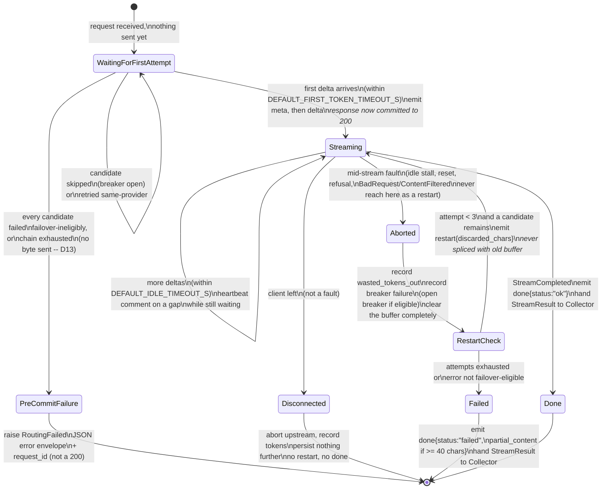
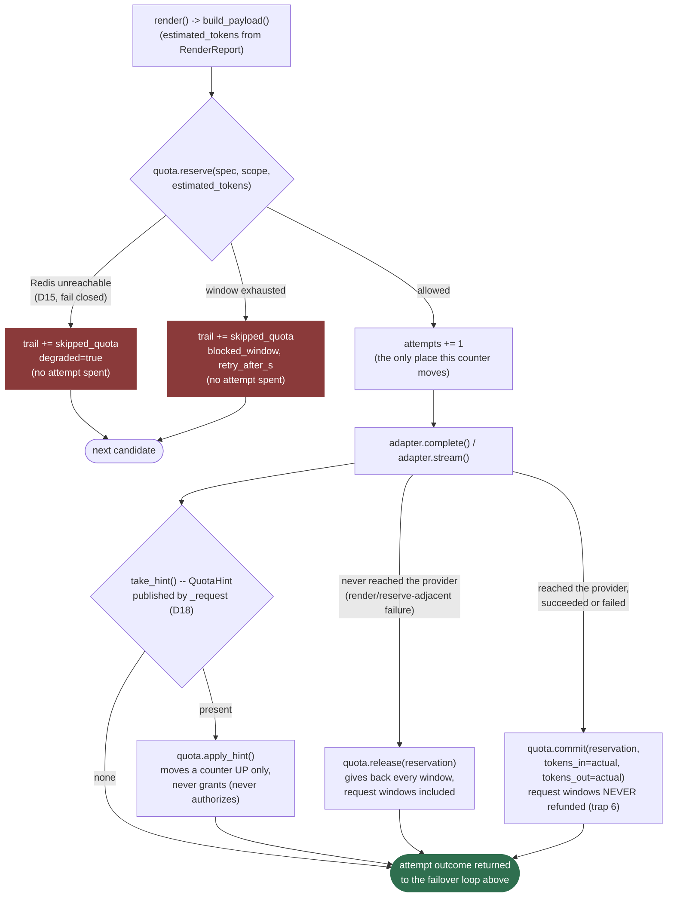
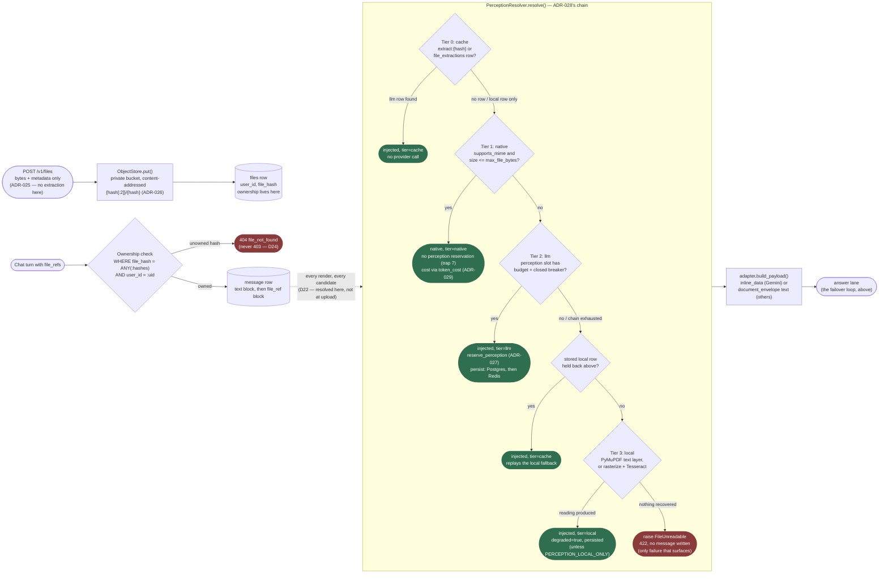
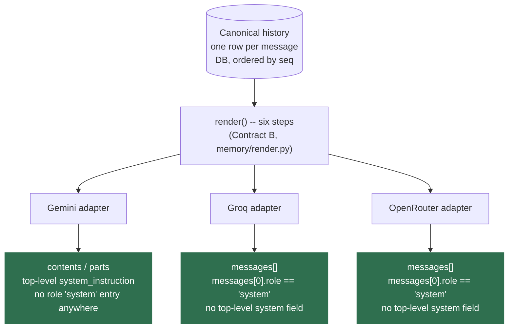
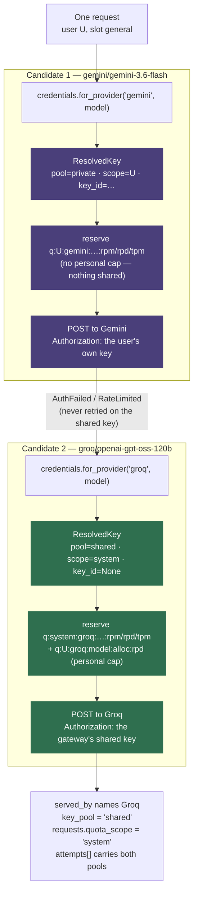
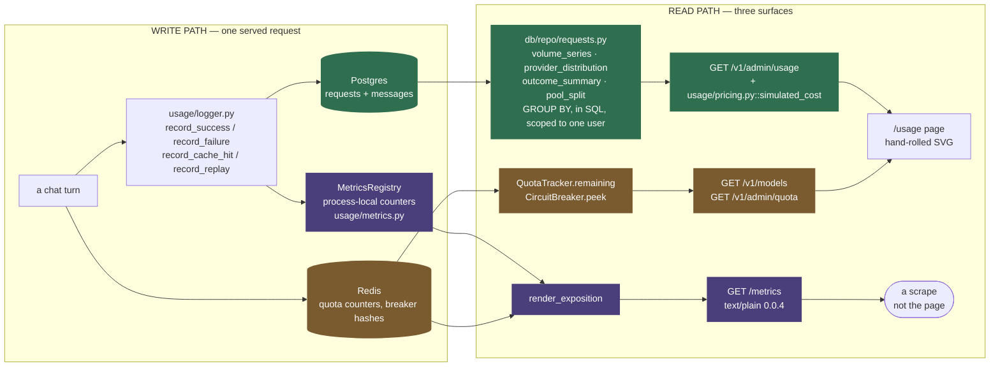

# Architecture

Two diagrams, both added at the close of Phase 2 because both only became true once Milestone B
landed: the failover loop that serves both the non-streaming and the streaming path
(`app/routing/router.py`), and the restart state machine layered on top of it for streaming turns
(`app/streaming/orchestrator.py`). Read alongside `doc/reference/contracts-and-phase1.md` §1 (D1/D2)
and `doc/reference/phase2.md` §3, which this page draws diagrams for rather than repeats.

---

## The failover loop

One entry point serves both `route` (non-streaming) and `route_stream` (streaming) — the alternative is
two copies of the attempt bookkeeping that drift, which `phase2.md` §4 Step 4 calls out explicitly. The
loop walks a candidate chain built by `selection.candidates()` (D10's named-slot spill, D11's
latency-ranked `auto` expansion) and makes exactly one branching decision per failure: *what kind* of
error was this, read off Contract A's class flags — never `isinstance`, never `adapter.name`.

**What is not on this diagram, deliberately:** the streaming path's first-token budget and mid-stream
restart. Those live one layer up — this loop only knows "the candidate I just tried failed before or
after producing a delta," and the *streaming-specific* consequence of a post-delta failure (never
retry, always restart) is the orchestrator's business, described next. `route_stream` reuses every box
above unchanged; it adds one extra rule not shown here — once a delta has been delivered, the same
candidate is never retried, because a restart onto a *different* provider is D1's mechanism for that
case, not this loop's own retry.

---

## The restart state machine (D1, streaming only)

`app/streaming/orchestrator.py::stream_completion` drives this on top of `route_stream`'s events
(`AttemptStarted`, `AttemptDelta`, `AttemptAborted`, `StreamCompleted`). The loop above decides *whether*
to try the next candidate; this state machine decides what the *client* is told and when the response
is allowed to start at all (D13).

**The rule the diagram cannot make self-evident, so it is stated here too:** `RestartCheck` never
re-enters `Streaming` on the *same* candidate. A candidate that delivered at least one delta and then
died has demonstrated it accepts a connection and then fails — a second attempt against it would spend
a budget slot exactly like an untried candidate, for worse odds. A restart always advances to a new
candidate; the same-provider retry in the failover loop above is reserved for failures that happened
*before* any content was shown.

---

## After `done` (D14)

Neither diagram shows persistence, on purpose — by the time either reaches a terminal state, the
response body is finished, and what happens next is a separate concern with its own lifetime rule
(ADR-016): the orchestrator holds no database session at any point above, and
`app/streaming/collector.py::Collector` opens one short-lived session *after* `Done` or `Failed`, writes
one row (or none, for a pre-commit failure — that one is the request-scoped session's job, one layer up
in `api/v1/chat.py`), commits, and closes. A persistence failure here is logged and swallowed, never
raised — there is no response left to turn it into.

---

## Phase 3: quota joins the loop

The insertion point the section above predicted is exactly where it landed: `render` → `quota.reserve`
→ `attempts += 1` → attempt, inside the same box the breaker check already occupied. Quota becomes a
second reason a candidate is skipped for free — `skipped_quota` alongside `skipped_breaker` — and
neither costs the three-attempt budget (ADR-015, [ADR-020](decisions/ADR-020-quota-reservation-placement.md)).

**Reserve is a filter that spends its own answer**, not a read followed by a write — the whole reason
Contract C mandates one Lua script rather than a pipelined check-then-increment (trap 2,
[ADR-020](decisions/ADR-020-quota-reservation-placement.md)). `reserve.lua` checks every declared
window before incrementing any of them, so a chain that blocks on window three never leaves windows
one and two overstated (trap 3).

**A reservation that expires mid-flight commits nothing rather than guessing.** `RESERVATION_TTL_S` is
120s; a stream that outlives it finds `commit.lua`'s reservation hash already gone and no-ops, logging
`quota.reservation_expired` — over-counting the original estimate rather than risking a blind delta
that double-counts a stream a `release` already refunded on another path.

**`apply_hint` runs after every attempt, success or failure**, draining whatever
`HttpProviderAdapter._request`/`_stream_events` published to the `QuotaHint` contextvar
([ADR-021](decisions/ADR-021-quotahint-transport.md)) — Groq and OpenRouter's own rate-limit headers
correcting the gateway's estimate toward ground truth, one direction only.

## Phase 4: two lanes, one system

Nothing on either diagram above needed to change shape for the perception lane —
`quota/lanes.py::reserve_perception` was the typed seam Phase 4 filled in, spending the half of
Gemini's budget D8's `reserved_fraction` had already fenced off from the answer lane the whole time.
What Phase 4 adds is a second lane feeding render step 1, and its own decision inside the box the
diagram above already labelled `render() -> build_payload()`.

**Every tier but the last is wrapped in `_guarded`**, not shown as a separate box because it applies
uniformly: an exception from any of tiers 0–2 is logged with the file hash and the tier, and the
chain falls through exactly as if that tier had declined on its own terms. Only `FileUnreadable` from
tier 3 is allowed to end the turn (ADR-028).

**The memo, also not drawn, is what makes this diagram honest under failover.** `PerceptionResolver`
is one instance per request, keyed on `(file_hash, native_wanted)` — so a turn that spills from Groq
to Gemini under D1 runs this chain once per distinct file, not once per attempt (ADR-025, trap 6). A
diagram of the chain alone would suggest it runs fresh every time render does; in practice the second
and third renders of one turn mostly hit the in-memory memo before this flowchart's first box.

**Bytes are fetched at most once per chain, and only when a tier needs them.** Tier 0 needs none —
the common case, a second turn about an already-read document, never calls `ObjectStore.get` at all.
A chain that falls from tier 1 through to tier 3 still only downloads once, held by `_Lazy` across the
tiers that share the need.

## Phase 5: one history, three shapes

Everything above this section describes how one attempt gets from a candidate to an answer. This
section is about the input side of that same attempt: one stored `CanonicalMessage` list, rendered
fresh for whichever provider the failover loop is about to try — never a second copy stored per
provider, never a translation cached from a previous attempt.

**The system message's two positions are the one divergence the canonical schema exists to absorb.**
Contract B stores exactly one system message, always `seq = 0`, with no opinion on where a provider
wants it — Gemini lifts it out of the message list entirely into a top-level `system_instruction`
field; Groq and OpenRouter, both OpenAI-shaped, leave it in place as `messages[0]`. Nothing about the
stored row changes between the two; `render()`'s adapter step is the only place that decision is made,
and it is made fresh on every single attempt — never cached, never decided once and reused, because the
provider about to be tried can change mid-request under D1/D2 and the shape has to follow it.

**A `file_ref` has no shape at all until render step 1 resolves it — proven by the golden matrix
(D31, [ADR-031](decisions/ADR-031-cross-provider-golden-matrix.md)).** The same stored block renders as
Gemini's `inline_data` when the file is native to that model, and as an injected `<document>` envelope
in the text of a provider that cannot read it — `tests/contract/test_cross_provider_matrix.py` asserts
that envelope is byte-identical across Groq and OpenRouter, the two providers it is injected for, which
is the concrete form of "one history, three shapes" this section is named after.

**The omission marker (D4) is the same story with no native representation on any provider.** A
history too long for the candidate's context window loses its oldest non-system messages and gains one
`[N earlier messages omitted]` line rendered into the surviving text — the exact line
`test_the_omission_marker_survives_into_every_providers_payload_text` finds identically in all three
payloads, because there is no `omitted_messages` field on any provider's wire format for `render()` to
target instead. `RenderReport.messages_dropped` carries the same count out of `render()` and off the wire
to the client (D34, [ADR-033](decisions/ADR-033-truncation-disclosed-and-uncached.md)) — the same
mechanism, read twice: once to build the marker a model reads, once to build the number a user reads.

**Continuity across a provider switch is a consequence of this diagram, not a separate mechanism.**
`api/v1/chat.py` loads the full stored history once per turn and calls `render()` once per attempt;
switching from `fast` to `general` mid-conversation, or failing over from Gemini to OpenRouter inside
one attempt, changes only which box on the right the same boxed history flows into. Nothing about the
history itself is provider-shaped at rest, which is the property `tests/integration/test_chat_endpoint.py`'s
`test_a_thread_survives_a_provider_switch` exercises end to end: three turns, three different served
providers, turn one's own words still present in what turn three's payload carries.

## Phase 6: two pools, one request

Everything above assumes one credential and one set of counters for the whole gateway. Phase 6 breaks
that assumption in the one place it is hardest to see from the code: **inside a single failover
chain**. BYOK is per provider, not per user (§9.5), so one request can cross a scope boundary
mid-chain — the user's own Gemini key pays for candidate 1, the gateway's shared Groq key pays for
candidate 2, and both are correct.

**One object answers both questions, per candidate** (D36,
[ADR-034](decisions/ADR-034-per-candidate-credential-resolution.md)). Before this phase the router
read its credential from `registry.system_key(provider)` inside the loop and its quota scope from a
`scope` parameter fixed for the whole request. Those are the same question at two granularities, and
keeping them apart guarantees the bug where a request spends a private key against the system
counters. `ProviderCredentials.for_provider(provider, model)` returns a `ResolvedKey` carrying the
key, the pool, the scope, the row id and the personal cap — and the `scope` parameter was deleted
rather than carried alongside, because two parameters that must agree eventually will not.

**The two branches differ in exactly one place beyond the scope string.** A private attempt reserves
the provider's published windows under `q:{user_id}:…` and nothing else — the budget being spent is
the user's own, and there is nothing to fence. A shared attempt reserves the same windows under
`q:system:…` **plus** one extra grant, `q:{user_id}:{provider}:{model}:alloc:rpd`, which is that
user's slice of the shared free tier (D39,
[ADR-036](decisions/ADR-036-personal-caps-under-frozen-contract-c.md)). Both go through
`reserve_windows` in a single atomic Lua call, so there is no window in which the pool counter moved
and the personal one did not.

**The chain proceeds; it does not launder.** A private key's `AuthFailed` or `RateLimited` fails that
*candidate*, and the next candidate resolves independently — it is never retried on the shared key
for the same provider (D40, [ADR-037](decisions/ADR-037-private-key-failure-is-not-laundered.md)).
Contract A already marks both errors `failover_eligible`, so this took no new mechanism: it is a
decision not to write a special case, plus one fire-and-forget write flipping the row's
`validation_status` so the settings page can say the key is broken.

**One request, one `quota_scope`, but a per-attempt trail.** `requests.quota_scope` records the
*winning* attempt's scope, reconstructed from `key_pool` plus the caller's own principal
(`resolver.quota_scope_for`) rather than threaded as a second raw field. The per-attempt truth is in
`requests.attempts`, where every `AttemptRecord` carries its own `key_pool` — which is what makes a
row like the one diagrammed above readable months later.

**The perception lane resolves its own chain, independently.** Tier 2's extraction candidates are
chosen inside `perception/extractors.py` and have nothing to do with whichever provider answers the
turn, so a user's own Gemini key can pay to *read* their document while Groq's shared key answers the
question about it. The extraction cache stays global and keyed on `file_hash` alone (D24): scoping it
per user to "keep private-key work private" would re-spend a provider's budget to recompute an
identical string, and that trade is documented in `docs/limitations.md` rather than made silently.

---

## Phase 7: reading the system back

Every diagram above is about serving a request. This one is about *reading what happened* — and it
exists because the dashboard raises a question the code answers in three different places. Three
numbers on one page ("how many requests", "how many requests", "how much budget is left") come from
three different stores with three different truth properties, and which one is authoritative depends
on which question is being asked.

**Green is durable and complete. Amber is live and correct but has no history. Purple is a sample.**
That is the whole distinction, and it is why the same count can legitimately appear twice with two
different values.

- **Postgres is the only complete record.** Every terminal outcome writes a `requests` row through
  one of `usage/logger.py`'s five facades, so the aggregates are exact over any window they can see —
  across restarts, across workers, across deploys. They are also the slowest, which is fine for a
  page somebody opened on purpose.
- **Redis is the only live one.** A quota remainder or a breaker state is a fact about *now* with no
  past tense; asking Postgres would answer a different question. Both `/v1/models` and
  `/v1/admin/quota` read it at request time and neither stores anything
  ([ADR-040](decisions/ADR-040-self-scoped-usage-dashboard.md) — the second delegates to the first's
  handler rather than re-deriving it, so the two cannot disagree).
- **The `/metrics` counters are process-local**, and they reset on every deploy and cold start
  ([ADR-044](decisions/ADR-044-hand-rolled-metrics-endpoint.md), ADR-014's precedent). The deployed
  service pins one worker, so a scrape sees the whole of one process today; raise `WEB_CONCURRENCY`
  and each scrape becomes a sample of whichever worker answered. The gauges in the same response are
  read live from Redis and are correct on any worker, which means one `/metrics` body legitimately
  mixes a process-local number with a shared one — said out loud in `docs/limitations.md` rather than
  papered over.

**The three surfaces answer three different questions, which is why none of them is redundant.**
`/usage` answers *what did my traffic do* — self-scoped, historical, costed at read time
([ADR-041](decisions/ADR-041-simulated-cost-at-read-time.md)). `/v1/models` answers *what can I use
right now*. `/metrics` answers *is this process healthy*, and is the only one of the three that is
system-wide rather than per-user — which is exactly why it is behind a bearer token instead of a
session, and why no label on it carries a user id.

**Two numbers on the page disagree on purpose.** Request volume counts every row, cache hits and
`status='replayed'` idempotent replays included, because the client really did make those requests.
Provider distribution excludes both — a cache hit names the candidate that *originally* answered, and
a replay never reached one — because counting them would report provider calls that never went out
(D45's table; traps 5, 6 and 18). Volume minus provider calls is a real, meaningful gap, and the
dashboard's own copy says so rather than hiding it by making the two agree.

**The buckets are generated, not discovered.** `volume_series` builds its time buckets with
`generate_series` and left-joins the rows onto them, so an hour in which nothing happened renders as
a zero bar. A `GROUP BY date_trunc` over the rows alone is shorter and silently omits quiet periods,
which draws a smooth line straight through an outage — the one chart bug that makes the system look
*better* the worse it behaved.
